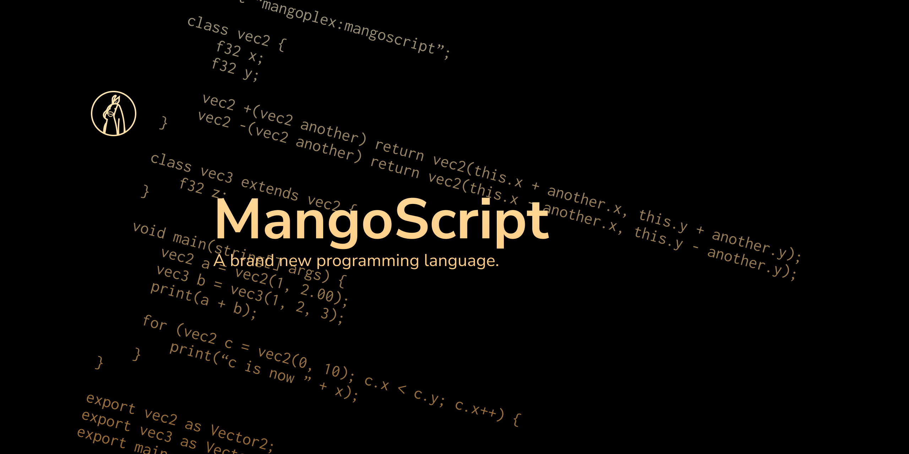

---

# MangoScript
## Take a look at the language
```mangoscript
// Single line comment
/* Multiple lines comment */

// Import from other module
// This will be handled by your ModuleResolver
import "custom path to other module";

// Make a new function
void main(string[] args) {
    print("Hello world!");
}

// Make a new class
class vec2 {
    f32 x;
    f32 y;

    void print() {
        print(this);
    }

    // Operator overloading
    vec2 +(vec2 another) return vec2(this.x + another.x, this.y + another.y);
    vec2 -(vec2 another) return vec2(this.x - another.x, this.y - another.y);
}

// Make another function
vec2 myFunction() {
    // Create a new vec2 object with default constructor
    // The default constructor's signature is vec2(f32?, f32?)
    // Use <type>? to turn the type into optional
    // Use <type>[] to turn the type into array (TODO: implement array)
    vec2 a = vec2();
    vec2 b = vec2(1);
    vec2 c = vec2(1, 2);
    vec2 negateOfC = -c; // negateOfC = vec2() - c;

    for (;;) break;
    labeledLoop: for(;;) break labeledLoop;
    // while (condition) {} and do {} while (condition);

    return a + b + c + negateOfC;
}

// Make another class
class vec3 extends vec2 {
    f32 z;
}

// Export our stuffs
export vec2;
export vec3;
export myFunction as testFunction;
```

If you are familiar with C-like languages like Java, C# or just C, you might see the syntax above quite similar with your language. If you are not familiar then the language is designed to be easy to understand (maybe you can't get the `class` part yet, but we'll get there eventually).

MangoScript contains some differences comparing to other C-like languages that might boggle your mind:
- There is no `null` in MangoScript. It has been replaced with `optional` (suffix your type with `?`). Optionals acts like `null`, but it works with primitive types while being able to enforce non-empty values (by relying on default states of the object). As of today, we are still trying to figure out how end user can construct `empty` (and maybe arrays as well).
- The language is relatively new and still under heavy development. We hope to finalize our language specification in the future.
- There is no interfaces (yet). We hope to tackle this down with our reserved `implements` keyword, where you can implement other class as interface, rather than defining your own interface. Interface functions doesn't have to be implemented, but interface fields must be available, either from superclass or current class.

## Using MangoScript
Currently, the only way to use MangoScript is to embed it with your Java application. Official standalone CLI is not available at this moment.

### From Jitpack
```groovy
repositories {
    maven { url = 'https://jitpack.io' }
}

dependencies {
    implementation 'com.github.mangoplex.mangoscript:mangoscript-binary:main-SNAPSHOT'
    // ...
}
```

### From source
> Requires Maven 3.

You can install MangoScript from source by cloning this repository and use `mvn install` to install it to local repository:

```console
$ git clone https://github.com/MangoPlex/MangoScript.git
$ cd MangoScript
$ mvn install
```

## Modules
MangoScript is consists of 3 modules:

### Binary
This module is like the core of MangoScript. It provides a data structure for working with MangoScript, such as module structure, types, functions, statements and expressions. This module does not contains any runtime-related stuffs, such as code optimization, type validation and compilation.

### Text
This module parses text data (which we are going to call them "code") into different structures. This module can be used to parse statements, expressions or an entire module code.

This module, just like Binary, does not contains code optimization and compilation. However, some basic type validation can happens (but only emit warnings).

### Runtime
This module is for running code, including optimizing code, compiling the code from Binary into different code (but more efficient) and run that code. Type validation must be performed during runtime.